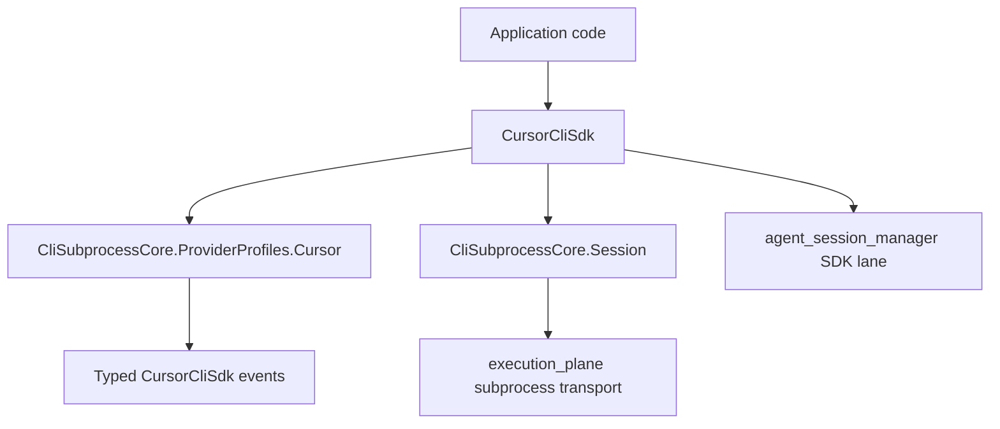

# Architecture

`cursor_cli_sdk` is a provider-native Elixir SDK above the normalized subprocess
stack. It does not implement its own erlexec transport.

## Layers

| Layer | Responsibility |
| --- | --- |
| `CursorCliSdk.Options` | Typed caller input and validation |
| `CursorCliSdk.ArgBuilder` | Cursor argv rendering |
| `CursorCliSdk.CLI` | Command resolution and invocation construction |
| `CursorCliSdk.Runtime.CLI` | Session-shaped runtime used by ASM and streams |
| `CursorCliSdk.Stream` | Lazy enumerable over runtime events |
| `CursorCliSdk.Types` | Projection from core events into SDK event structs |
| `CliSubprocessCore.ProviderProfiles.Cursor` | Canonical Cursor NDJSON parser and core invocation profile |
| `execution_plane` | Process execution transport |

## Boundary Rule

The SDK is provider-native, but it still shares the normalized parser and
subprocess kernel with other CLI providers. Cursor-specific flags live in
`Options` and `ArgBuilder`; command execution and event transport stay in
`cli_subprocess_core` / `execution_plane`.

## ASM

ASM uses `CursorCliSdk.Runtime.CLI` on its `:sdk` lane. The `:core` lane remains
available through `CliSubprocessCore.ProviderProfiles.Cursor`.
